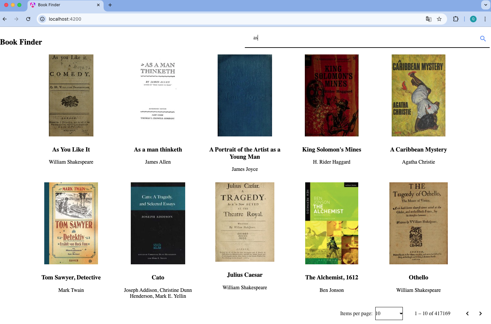

# Search App

This project is an Angular application that provides a search interface to fetch and display book results from the Open Library API. It uses Angular, RxJS, and Angular Material for a responsive user experience.

## Technologies Used

Angular: For building dynamic and scalable web applications.  
RxJS: For handling asynchronous data streams.  
Angular Material: Pre-built, customizable UI components.  
TypeScript: Adds static types for better development and tooling.  
Open Library API: Access to book metadata.  

## Features



1. Enter a search term in the input field.
2. Click the Search button or press Enter.
3. Browse the search results with pagination.

## Run the project

1. Install dependencies
```bash
    npm install
```

2. Run the development server
```bash
    npm start
```

3. Open the browser and go to: http://localhost:4200/


## Reference:

Angular: https://www.youtube.com/watch?v=oUmVFHlwZsI  
Angular TypeScript: https://www.youtube.com/watch?v=k5E2AVpwsko  
Angular RxJS: https://www.youtube.com/watch?v=65Us8NwmYf4  
Angular Material: https://material.angular.io/components/categories  
Open Library Search API: https://openlibrary.org/dev/docs/api/search  
